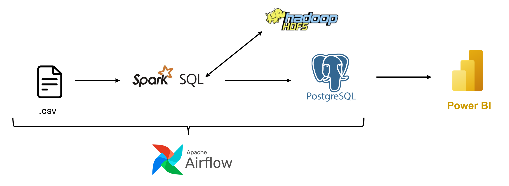
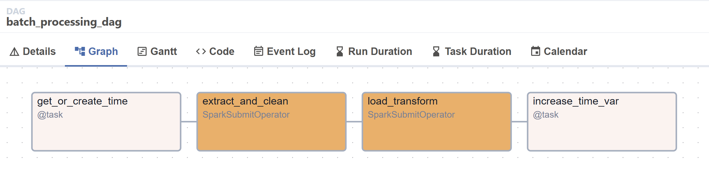

# Mini Project – Viettel Digital Talent 2025 – Data Engineering

## Overview
### Project Title: Data Analytics Dashboard

### Description:
This project aims to build a complete data analytics pipeline to analyze user behavior on an e-commerce platform. From raw transaction logs to insightful dashboards, the system automates data ingestion, processing, and visualization. Data is processed through an ETL pipeline using Apache Spark, stored in HDFS, automated by Airflow, and the results are loaded into PostgreSQL. Power BI is used to create interactive dashboards for business intelligence and decision-making.

## System Architecture


## Deployment and Installation

### Prerequisites

- Docker & Docker Compose
- Git
- Power BI Desktop (for viewing the dashboard)
---
### Clone the repository

```bash
git clone https://github.com/quandao073/data-analytics-dashboard.git

cd data-analytics-dashboard
```
---
### Start the Containers
```bash
docker-compose up -d
```

This will launch the following services:

- Airflow Webserver: http://localhost:8081/
- PostgreSQL (Data Warehouse)
- Apache Spark: http://localhost:8088/
- HDFS (Hadoop): http://localhost:9870/
---
### Ingesting Data and Running the Pipeline
- Add raw data into the `/data` folder in the project root
- Access the Airflow UI at [http://localhost:8081](http://localhost:8081), login with username: `airflow` and password:   `airflow`, then trigger the ETL DAG in Airflow
---
### Connect Power BI to PostgreSQL
In Power BI Desktop:

1. Go to **Home → Get Data → PostgreSQL**
2. Enter the connection parameters:
   - Server: `localhost`
   - Database: `ecommerce_analytics`
   - Username: `quanda`
   - Password: `quanda`
3. Select tables such as `fact_events`, `dim_product`, `predicted_revenue`...
4. Create your dashboard visuals from there.

## Result





